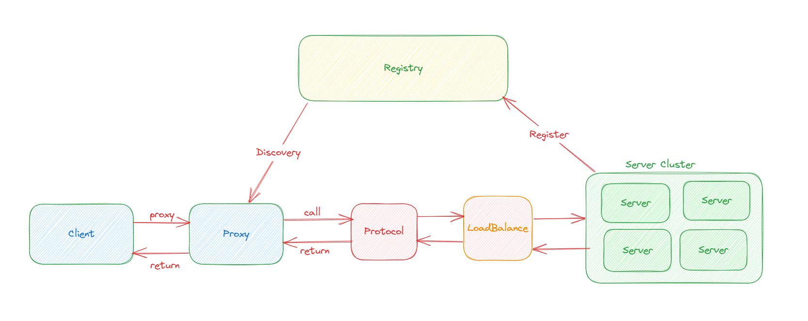

# rpc-framework
使用Netty、Zookeeper、Spring等框架手写的一个简单RPC框架，仅用于个人学习！

## 项目的整体架构


---
客户端与服务端进行通信
- 代理层，主要作用是让远程调用像本地调用一样方便，由代理层去进行通信，主要用`JDK`的动态代理实现；
- 注册中心层，当服务端节点增多时，单纯的使用`ip + port`调用服务就显得很冗余，这时候注册中心就是很好的解决方案，使用`Zookeeper`实现；
- 协议层，服务间通信网络传输非常重要，通信方式使用`Netty`的`NIO`通信，协议使用自定义协议，序列化使用`Hessian`、`Kryo`、`Protostuff`；
- 负载均衡层，节点变多后，需要一种策略来帮助我们知道调用哪一个节点；
- ......

---
代码架构：
```
rpc-framework
├─demo-rpc-client     客户端测试模块
├─demo-rpc-server     服务端测试模块
├─hello-service-api   api模块
├─rpc-common          rpc公共模块
└─rpc-core            rpc核心模块
```

