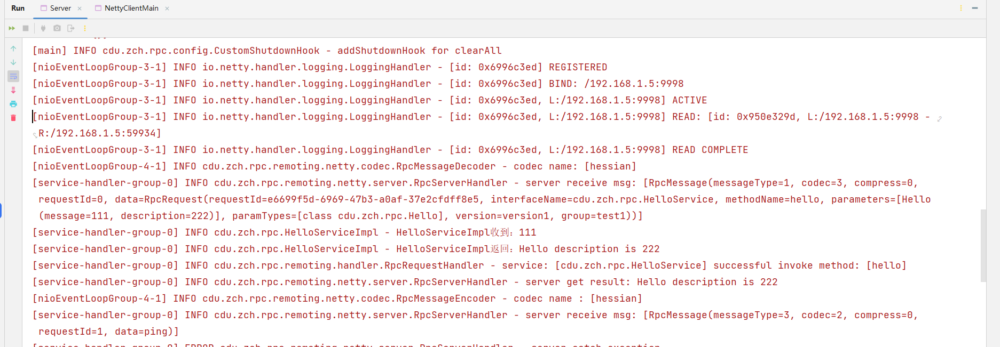
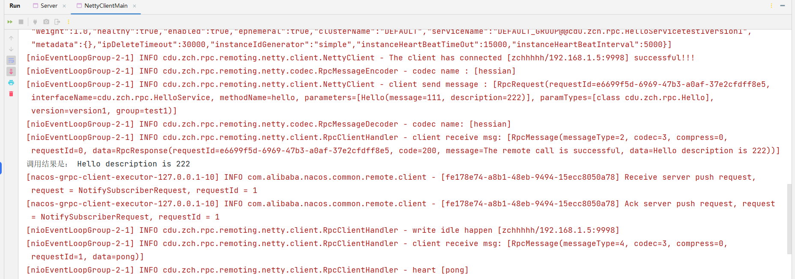

<div align="center"><a href='./README.zh.md'>中文</a> | 英文</div>

# rpc-framework

A simple RPC framework handwritten using Netty, Zookeeper, Spring and other frameworks, only for personal learning!</br>
At present, the project is still in iteration... There are still many coupling places in the code, which need to be improved!</br>
The `dev` branch is the development branch, and the `main` branch is the default full branch.

## project structure


---
Client communicates with server
- proxy layer, The main function of the proxy layer is to make remote calls as convenient as local calls, and the proxy layer communicates, mainly using the dynamic proxy of `JDK`;
- registry layer, When the number of server nodes increases, simply using `ip + port` to call the service is very redundant. At this time, the registration center is a good solution, using `Zookeeper` or `Nacos` to achieve;
- protocol layer, Inter-service communication network transmission is very important. The communication method uses `NIO` communication of `Netty`, the protocol uses a custom protocol, and the serialization uses `Hessian`, `Kryo`, `Protostuff`;
- load balancing layer, After the number of nodes increases, a strategy is needed to help us know which node to call. The algorithm strategies currently supported by this project include `random`, `polling`, `LFU`, `LRU`, `consistent hashing`, The default is `consistent hashing`;
- ......

---
Code structure:
```
rpc-framework
├─demo-rpc-client     Client Test Module
├─demo-rpc-server     Server Test Module
├─hello-service-api   api module
├─rpc-common          rpc public module
└─rpc-core            rpc core module
```
## project core
1. Protocol layer design
```
Using a custom protocol, the protocol is as follows:

0     1     2     3     4        5     6     7     8         9          10      11     12  13  14   15 16    -- byte length
+-----+-----+-----+-----+--------+----+----+----+------+-----------+-------+----- --+-----+-----+-------+
|   magic   code        |version | full length         |messageType| codec |compress|    requestId      |    -- request header
+-----------------------+--------+---------------------+-----------+-----------+-----------+------------+
|                                                                                                       |
|                                         body                                                          |    -- request body
|                                                                                                       |
|                                        ... ...                                                        |
+-------------------------------------------------------------------------------------------------------+
- magic code: Magic number, usually represented by 4 bytes, used to determine whether it is a valid data packet
- version: Version number, represented by 1 byte, can support protocol upgrade
- full length: The length of the request body, represented by 4 bytes, indicates the length of the message in the request body
- massageType: Message type, represented by 1 byte, which type of message it is, such as request, response, heartbeat, etc.
- codec: Encoding type, represented by 1 byte, serialization algorithm type, such as Kryo, Hessian, Protostuff, etc.
- compress: Compression type, represented by 1 byte, compression algorithm type, such as GZIP, LZ4, etc.
- requestId: Request ID, represented by 4 bytes, a symbol of full-duplex communication, the unique ID cannot be repeated, and provides asynchronous capability
```
There is also a corresponding package for each request to call the service
```java
public class RpcRequest implements Serializable {

    private static final long serialVersionUID = 1905122041950251207L;

    // Request ID, generated using UUID
    private String requestId;

    // interface name
    private String interfaceName;

    // method name
    private String methodName;

    // parameter list
    private Object[] parameters;

    // List of parameter types
    private Class<?>[] paramTypes;

    // version number
    private String version;

    // group name
    private String group;

    public String getRpcServiceName() {
        return this.getInterfaceName() + this.getGroup() + this.getVersion();
    }

}
```
2. For the design of the proxy layer, this project uses the dynamic proxy of JDK, which is also the most commonly used proxy method.
3. The design of the registration center layer, this project uses Zookeeper and Nacos two registration centers, the default is Zookeeper.
4. The multiThreaded design of the server, because Netty is based on the asynchronous design of NIO, the thread for processing connection and IO on the server should not be the same, so the server uses a large number of CompletableFuture asynchronous processing, which is very elegant.
---
## Project can be optimized
1. In the transmission of the protocol layer, there should be a variety of compression methods to choose from. This project only uses `GZIP` compression for the time being;
2. Regardless of the serialization method or the compression method, it should be decoupled in the form of a configuration file. To give users a choice, this project does not use the configuration method;
3. Add a fault-tolerant layer, and there may be service interruptions during project operation. At this time, it is necessary to use the fault-tolerant layer to check the service;
4. Add a link tracking layer to track the project operation process;
5. Routing
6. monitor
7. Extended optimization
8. ......
---
## Project Highlights
1. The project is decoupled through the `SPI` mechanism, which improves the scalability of the project;
2. On the server side, multi-threading is used to process events concurrently, and handle various events gracefully.
3. Some design patterns are interspersed in the project to improve the reusability and readability of the code.
4. The project is modularized through `Maven`, which improves the maintainability of the project.
5. The expansion is selected through the configuration file, which increases the usability of the system.
5. ......
---
## Design patterns used in the project
1. **Singleton**, and create an example using a singleton factory, which is itself a singleton;
```java
public final class SingletonFactory {

    private static final Map<String, Object> OBJECT_MAP = new ConcurrentHashMap<>();

    private SingletonFactory() {
    }

    public static <T> T getInstance(Class<T> c) {
        if (c == null) {
            throw new IllegalArgumentException();
        }
        String key = c.toString();
        if (OBJECT_MAP.containsKey(key)) {
            return c.cast(OBJECT_MAP.get(key));
        } else {
            return c.cast(OBJECT_MAP.computeIfAbsent(key, k -> {
                try {
                    return c.getDeclaredConstructor().newInstance();
                } catch (InstantiationException | IllegalAccessException | InvocationTargetException | NoSuchMethodException e) {
                    throw new RuntimeException(e.getMessage(), e);
                }
            }));
        }
    }

}
```
2. **Abstract Factory**, when using load balancing, considering that load balancing has only one role, it is abstracted as an interface, and an abstract class is used to implement the interface. Subsequent load balancing strategies only need to implement this abstract class.</br>

## The project runs by default
1. Download Zookeeper from the official website: [download](https://zookeeper.apache.org/releases.html), download and decompress `zkServer.md` in the bin directory, double-click to run it, this project uses **3.7.1 version**, try to be consistent to avoid problems.
2. Find the **demo-rpc-server** module in the project and run **Server**</br>

3. Find the **demo-rpc-client** module in the project, run **NettyClientMain**</br>

4. After running successfully, you can see:</br>
</br>

---
## Project change registry run
This project uses zookeeper and nacos as the configuration center. When running the project, you only need to choose one of them. The default is zookeeper.
- first step, Find the `demo-rpc-server` and `demo-rpc-client` modules of the project, and modify the configurations in the rpc.properties file respectively:
```properties
# rpc.zookeeper.address=127.0.0.1:2181
rpc.nacos.address=127.0.0.1:8848
```
- The second step, start the project, Start zookeeper or nacos, and then run the project.
- Server</br>
  
- Client</br>
  
## Project Change Load Balancer Run
To be perfected. . .</br>
This project is only used as my own learning project, and I am also learning. This project refers to other people's open source projects. The big guy wrote it very well. I am currently studying and will continue to optimize it later.