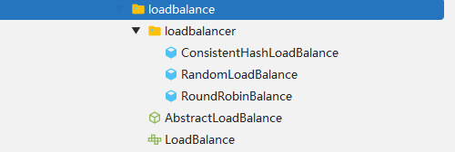
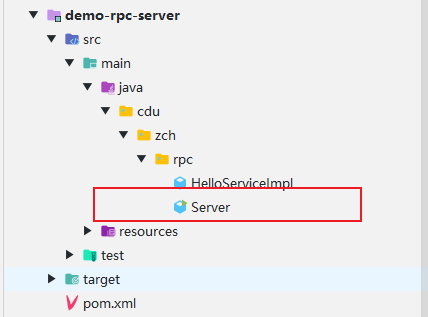
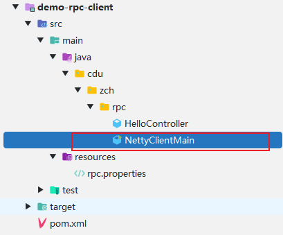
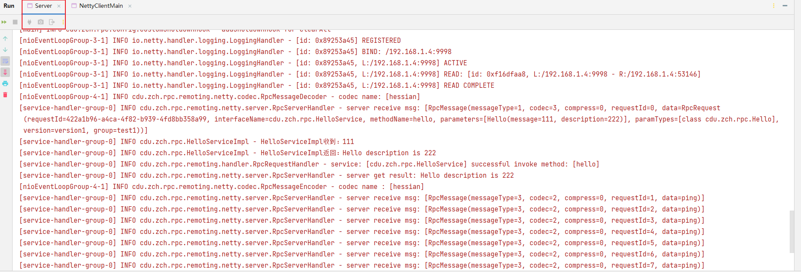
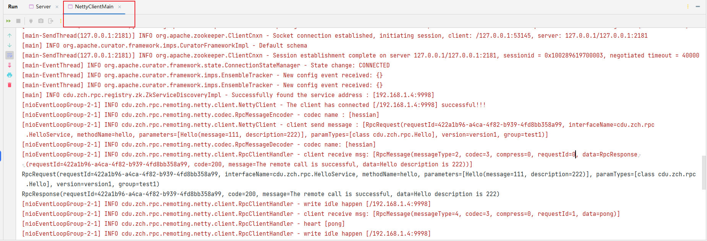

# rpc-framework
使用Netty、Zookeeper、Spring等框架手写的一个简单RPC框架，仅用于个人学习！

## 项目的整体架构


---
客户端与服务端进行通信
- 代理层，主要作用是让远程调用像本地调用一样方便，由代理层去进行通信，主要用`JDK`的动态代理实现；
- 注册中心层，当服务端节点增多时，单纯的使用`ip + port`调用服务就显得很冗余，这时候注册中心就是很好的解决方案，使用`Zookeeper`实现；
- 协议层，服务间通信网络传输非常重要，通信方式使用`Netty`的`NIO`通信，协议使用自定义协议，序列化使用`Hessian`、`Kryo`、`Protostuff`；
- 负载均衡层，节点变多后，需要一种策略来帮助我们知道调用哪一个节点，本项目目前支持的算法策略有`随机`、`轮询`、`LFU`、`LRU`、`一致性哈希`，默认是`一致性哈希`；
- ......

---
代码架构：
```
rpc-framework
├─demo-rpc-client     客户端测试模块
├─demo-rpc-server     服务端测试模块
├─hello-service-api   api模块
├─rpc-common          rpc公共模块
└─rpc-core            rpc核心模块
```
## 项目核心
1. 协议层的设计
```
采用自定义协议，协议如下：

0     1     2     3     4        5     6     7     8         9          10      11     12  13  14   15 16    -- 字节长度
+-----+-----+-----+-----+--------+----+----+----+------+-----------+-------+----- --+-----+-----+-------+
|   magic   code        |version | full length         | messageType| codec|compress|    requestId      |    -- 请求头
+-----------------------+--------+---------------------+-----------+-----------+-----------+------------+
|                                                                                                       |
|                                         body                                                          |    -- 请求体
|                                                                                                       |
|                                        ... ...                                                        |
+-------------------------------------------------------------------------------------------------------+
- magic code: 魔法数，通常使用4个字节表示，用来判断是否是有效数据包
- version: 版本号，使用1个字节表示，可以支持协议的升级
- full length: 请求体的长度，使用4个字节表示，表示请求体中消息的长度
- massageType: 消息类型，使用1个字节表示，表示是哪种类型的消息，如请求、响应、心跳等
- codec: 编码类型，使用1个字节表示，序列化算法类型，如Kryo、Hessian、Protostuff等
- compress: 压缩类型，使用1个字节表示，压缩算法类型，如GZIP、LZ4等
- requestId: 请求ID，使用4个字节表示，全双工通信的标志，唯一ID不能重复，提供异步能力
```
对于每次调用服务的请求也有相应的封装
```java
public class RpcRequest implements Serializable {

    private static final long serialVersionUID = 1905122041950251207L;

    // 请求ID，使用UUID生成
    private String requestId;

    // 接口名
    private String interfaceName;

    // 方法名
    private String methodName;

    // 参数列表
    private Object[] parameters;

    // 参数类型列表
    private Class<?>[] paramTypes;

    // 版本号
    private String version;

    // 组名
    private String group;

    public String getRpcServiceName() {
        return this.getInterfaceName() + this.getGroup() + this.getVersion();
    }

}
```
2. 代理层的设计，本项目采用的是JDK的动态代理，也是最常用的代理方式
3. 注册中心层的设计，本项目采用的Zookeeper作为注册中心，后面会加上Nacos
4. 服务端多线程设计，由于Netty是基于NIO的异步设计的，所以服务端处理连接和IO的线程都不应该是同一个，因此服务端大量采用了CompletableFuture异步处理，非常优雅
---
## 项目可优化的点
1. 在协议层的传输中，压缩方式应该可以选择多种，本项目暂时只用了`GZIP`压缩；
2. 不管是注册中心、序列化方式、压缩方式，都应该以配置文件的方式进行解耦，要给用户可选择的余地，本项目未使用配置的方式；
3. 增加容错层，项目运行中可能会有服务中断的现象，这时候就需要使用容错层对服务进行排查；
4. 增加链路追踪层，对项目运行流程进行追踪；
5. ......
---
## 项目亮点
1. 通过`SPI`机制对项目进行解耦，提高了项目的可扩展性；
2. 在服务端采用多线程的方式进行事件的并发处理，优雅地处理各种事件。
---
## 项目中使用到的设计模式
1. **单例模式**，并且使用单例工厂创建示例，这个工厂本身也是单例的；
```java
public final class SingletonFactory {

    private static final Map<String, Object> OBJECT_MAP = new ConcurrentHashMap<>();

    private SingletonFactory() {
    }

    public static <T> T getInstance(Class<T> c) {
        if (c == null) {
            throw new IllegalArgumentException();
        }
        String key = c.toString();
        if (OBJECT_MAP.containsKey(key)) {
            return c.cast(OBJECT_MAP.get(key));
        } else {
            // "computeIfAbsent"方法将新实例使用键放入"OBJECT_MAP"，并返回该实例。
            return c.cast(OBJECT_MAP.computeIfAbsent(key, k -> {
                try {
                    // 使用反射创建该类的新实例
                    return c.getDeclaredConstructor().newInstance();
                } catch (InstantiationException | IllegalAccessException | InvocationTargetException | NoSuchMethodException e) {
                    throw new RuntimeException(e.getMessage(), e);
                }
            }));
        }
    }

}
```
2. **抽象工厂模式**，在使用负载均衡的时候，考虑到负载均衡只有一个作用，因此抽象出来为一个接口，并使用一个抽象类实现接口，后续的负载均衡策略只需要实现这个抽象类即可
    
    
## 项目运行
1. 下载Zookeeper，官网下载：[下载地址](https://zookeeper.apache.org/releases.html)，下载解压在bin目录下的`zkServer.md`，双击运行即可，本项目使用**3.7.1版本**，尽量一致避免出现问题。 

2. 找到项目中的**demo-rpc-server**模块，运行**Server**

    

3. 找到项目中的**demo-rpc-client**模块，运行**NettyClientMain**

     

4. 运行成功后可看到：
    
    
---

本项目只作为自己的学习项目，本人也在学习中，该项目参考的是别人的开源项目，大佬写的非常棒，目前处于学习中，后期会不断优化的。