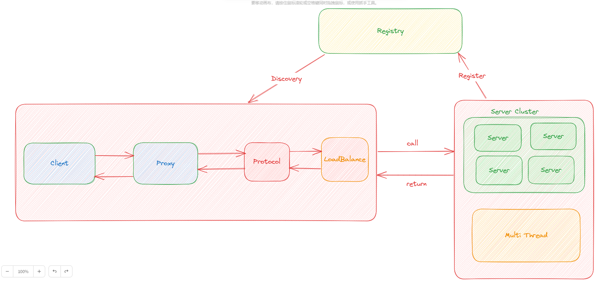

# rpc-framework
使用Netty、Zookeeper、Spring等框架手写的一个简单RPC框架，仅用于个人学习！

## 项目的整体架构


---
客户端与服务端进行通信
- 代理层，主要作用是让远程调用像本地调用一样方便，由代理层去进行通信，主要用`JDK`的动态代理实现；
- 注册中心层，当服务端节点增多时，单纯的使用`ip + port`调用服务就显得很冗余，这时候注册中心就是很好的解决方案，使用`Zookeeper`实现；
- 协议层，服务间通信网络传输非常重要，通信方式使用`Netty`的`NIO`通信，协议使用自定义协议，序列化使用`Hessian`、`Kryo`、`Protostuff`；
- 负载均衡层，节点变多后，需要一种策略来帮助我们知道调用哪一个节点；
- ......

---
代码架构：
```
rpc-framework
├─demo-rpc-client     客户端测试模块
├─demo-rpc-server     服务端测试模块
├─hello-service-api   api模块
├─rpc-common          rpc公共模块
└─rpc-core            rpc核心模块
```
---
## 项目可优化的点
1. 在协议层的传输中，压缩方式应该可以选择多种，本项目暂时只用了`GZIP`压缩；
2. 不管是注册中心、序列化方式、压缩方式，都应该以配置文件的方式进行解耦，要给用户可选择的余地，本项目未使用配置的方式；
3. 增加容错层，项目运行中可能会有服务中断的现象，这时候就需要使用容错层对服务进行排查；
4. 增加链路追踪层，对项目运行流程进行追踪；
5. ......
---
## 项目亮点
1. 通过`SPI`机制对项目进行解耦，提高了项目的可扩展性；
2. 在服务端采用多线程的方式进行事件的并发处理，优雅地处理各种事件。
---
## 项目运行
1. 下载Zookeeper，官网下载：[下载地址](https://zookeeper.apache.org/releases.html)，下载解压在bin目录下的`zkServer.md`，双击运行即可，本项目使用**3.7.1版本**，尽量一致避免出现问题。 
2. 找到项目中的**demo-rpc-server**模块，运行**Server**
  
3. 找到项目中的**demo-rpc-client**模块，运行**NettyClientMain**
  
4. 运行成功后可看到：
  
  
---

本项目只作为自己的学习项目，本人也在学习中，该项目参考的是别人的开源项目，大佬写的非常棒，目前处于学习中，后期会不断优化的。